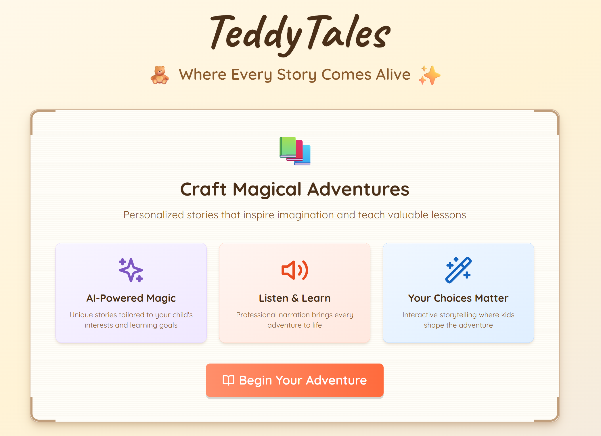
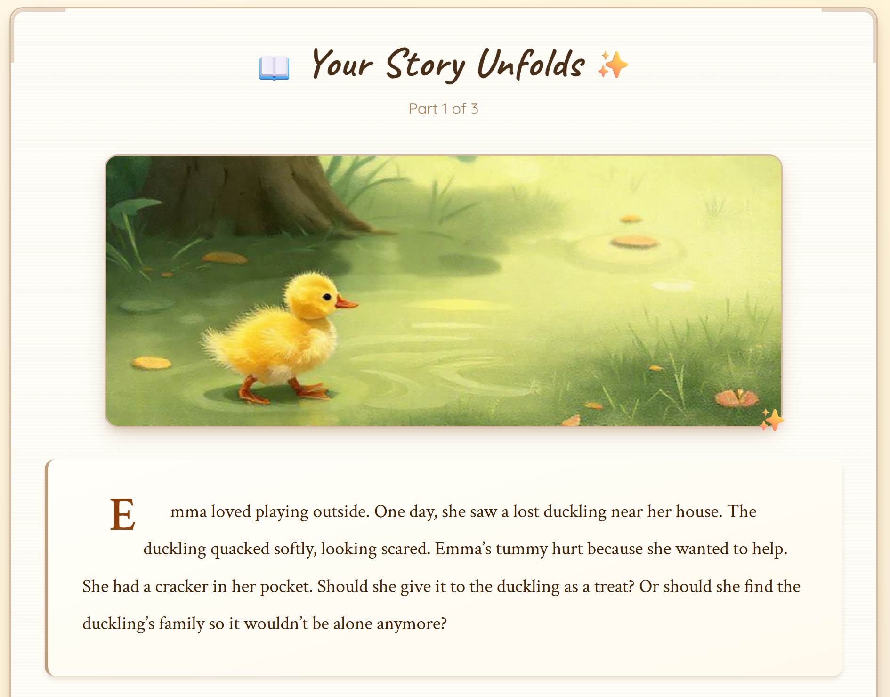

# 🎭 TeddyTales - Stories that grow with your child

<div align="center">

**An AI-powered interactive storytelling platform that creates personalized, narrated adventures for children**

[](https://teddytales.vercel.app/)
[](https://ai-storyteller.01kc54r6ayz240zq9k7z4c7yxh.lmapp.run)
[](LICENSE)



**Interactive Story Experience**


</div>

---

## 🌟 Live Demo

- **🚀 Application**: [https://teddytales.vercel.app/](https://teddytales.vercel.app/)
- **🔌 Backend API**: [https://ai-storyteller.01kc54r6ayz240zq9k7z4c7yxh.lmapp.run](https://ai-storyteller.01kc54r6ayz240zq9k7z4c7yxh.lmapp.run)

---

## 📖 What is TeddyTales?

TeddyTales generates personalized, interactive stories where kids can choose what happens next. Parents and educators can adjust language difficulty, pick life lessons to highlight, or let the system tailor everything automatically. 

A playful learning tool designed to support early literacy, creativity, and emotional growth - giving every child a creative space where their ideas shape the stories they hear.

---

## ✨ Key Features

- **🎨 Personalized Stories** - Child's name, age, and interests shape each adventure
- **🗣️ Natural Voice Narration** - ElevenLabs TTS brings stories to life
- **🎮 Interactive Choices** - Kids decide what happens next
- **🖼️ AI Illustrations** - Pollinations.ai generates story visuals
- **📚 Adjustable Learning** - Control language difficulty and life lessons
- **⚡ Fast & Reliable** - Vultr Inference powers instant story generation

---

## 🛠️ Technology Stack

### Backend (Raindrop Platform)
- **Framework**: Hono.js (Fast, lightweight web framework)
- **AI Inference**: Vultr Serverless Inference (DeepSeek-R1-Distill-Qwen-32B)
- **Text-to-Speech**: ElevenLabs TTS API
- **Database**: Raindrop SmartSQL (PostgreSQL)
- **Storage**: Raindrop Bucket Storage
- **Deployment**: Raindrop Cloud Platform
- **Development**: Built with Raindrop Code (Claude-powered AI assistant)

### Frontend
- **Framework**: React 18 with TypeScript
- **Build Tool**: Vite
- **Styling**: Tailwind CSS with custom animations
- **Image Generation**: Pollinations.ai API
- **Deployment**: Vercel
- **UI Components**: Custom child-friendly components with Framer Motion

### Integration & Tools
- **AI Development**: LiquidMetal Raindrop-code
- **Version Control**: Git
- **Package Management**: npm (workspace monorepo)

---

## 🏗️ Architecture Overview

```
┌─────────────────────────────────────────────────────────────┐
│                    Frontend (Vercel)                         │
│  React + TypeScript + Tailwind CSS + Framer Motion          │
│  https://teddytales.vercel.app/                             │
└────────────────────────┬────────────────────────────────────┘
                         │ REST API
                         ▼
┌─────────────────────────────────────────────────────────────┐
│              Backend API (Raindrop Platform)                 │
│  Hono.js • SmartSQL • Bucket Storage                        │
│  https://ai-storyteller.01kc54r6ayz240zq9k7z4c7yxh.lmapp.run│
└──────┬──────────────────┬──────────────────┬────────────────┘
       │                  │                  │
       ▼                  ▼                  ▼
┌─────────────┐  ┌──────────────┐  ┌────────────────┐
│   Vultr     │  │  ElevenLabs  │  │ Pollinations.ai│
│  Inference  │  │     TTS      │  │  Image Gen     │
│  (Stories)  │  │  (Narration) │  │ (Illustrations)│
└─────────────┘  └──────────────┘  └────────────────┘
```

---

## 🚀 Quick Start

### Prerequisites
- Node.js 18+
- npm or yarn
- Raindrop CLI (for backend deployment)

### Running Locally

#### Frontend
```bash
cd apps/ai-storyteller-frontend
npm install
npm run dev
# Visit http://localhost:5173
```

#### Backend
```bash
cd apps/ai-storyteller
npm install
raindrop build deploy --start
```

### Environment Variables

**Backend** (Raindrop environment):
```bash
ELEVENLABS_API_KEY=your_elevenlabs_key
VULTR_INFERENCE_API_KEY=your_vultr_key
TTS_VOICE_ID=EXAVITQu4vr4xnSDxMaL
STORY_MODEL=llama-3.1-8b-instant
```

---

## 📡 API Documentation

### Core Endpoints

#### `POST /start-story`
Creates a new personalized story with audio narration.

**Request:**
```json
{
  "child_name": "Emma",
  "age": 6,
  "theme": "adventure",
  "english_level": "beginner",
  "lesson_of_day": "friendship"
}
```

**Response:**
```json
{
  "story_id": 1,
  "segment_id": 1,
  "segment_text": "Once upon a time...",
  "audio_url": "https://ai-storyteller.../get-audio/story-1-segment-1.mp3",
  "choice_question": "What should Emma do next?",
  "segment_order": 0,
  "is_conclusion": false
}
```

#### `POST /continue-story`
Continues the story based on child's choice.

#### `GET /get-audio/:audioKey`
Retrieves audio narration for a story segment.

#### `GET /health/services`
Returns status of all integrated services.

See [API.md](apps/ai-storyteller/API.md) for complete documentation.

---

## 🎯 Hackathon Integration

### Required Technologies

✅ **Raindrop Platform**
- Backend API deployed on Raindrop infrastructure
- SmartSQL for database management
- Bucket storage for audio files
- Built entirely using Raindrop Code (Claude-powered AI assistant)

✅ **Vultr Services**
- Vultr Serverless Inference for story generation
- DeepSeek-R1-Distill-Qwen-32B model
- Real-time AI inference for dynamic content

✅ **ElevenLabs (Voice Agent Category)**
- Professional text-to-speech narration
- Sarah voice (warm, child-friendly)
- Seamless integration with story flow

### Additional Integrations
- **Pollinations.ai**: AI-generated story illustrations
- **Vercel**: Production frontend hosting
- **Raindrop MCP Server**: Development workflow with Claude Code

---

## 🎓 Educational Impact

TeddyTales serves as an educational tool for:

- **Language Learning**: Age-appropriate vocabulary and sentence structure
- **Decision Making**: Interactive choices teach consequence and reasoning
- **Reading Comprehension**: Audio + text reinforces literacy
- **Creativity**: Personalized stories spark imagination
- **Accessibility**: Audio narration helps struggling readers

Perfect for parents, teachers, and educational institutions seeking engaging learning tools.

---

## 🔮 What's Next

- Multi-language support (Chinese, Thai, Vietnamese, etc.)
- 3D avatar narration (e.g., Trulience)
- Vocabulary lists and flashcards for language learning
- Animated video story generation
- Interactive, conversational AI characters
- Mobile apps (iOS/Android)
- Teacher tools for classroom use

---

## 🐛 Known Limitations

- **SmartMemory**: Initially planned but disabled due to latency issues
- **Vultr GPU**: Not utilized (requires payment setup)
- **Story Length**: Currently limited to maintain engagement
- **Voice Options**: Using single voice (Sarah) for consistency

---

## 📄 License

This project is licensed under the MIT License - see the [LICENSE](LICENSE) file for details.

---

## 🙏 Acknowledgments

- **LiquidMetal AI** for the Raindrop Platform and excellent developer experience
- **Vultr** for serverless inference infrastructure
- **ElevenLabs** for professional text-to-speech technology
- **Pollinations.ai** for AI image generation
- **Vercel** for seamless frontend deployment
- The AI Champion Ship hackathon organizers and community
